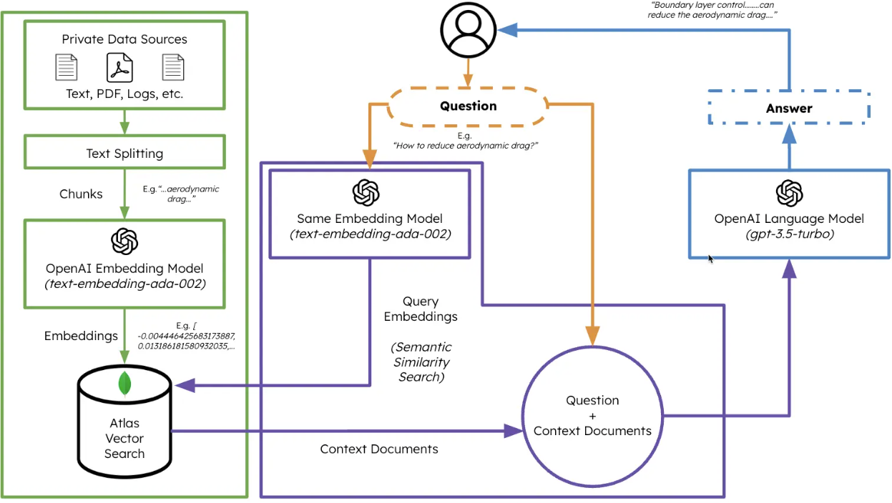

# Retrieval-Augmented Generation (RAG)

GitHub repository dedicated to Retrieval-Augmented Generation for Natural Language Processing (NLP).

### Theory

[Retrieval-Augmented Generation](https://arxiv.org/abs/2005.11401) (RAG) is an advanced technique in natural language
processing (NLP) that combines `Retrieval` and `Text Generation` capabilities to improve the performance of `Large
Language Models` (LLM).

Essentially, RAG works by integrating a generative language model with an information retrieval system. The generative
model can be a large language model such as GPT (Generative Pre-trained Transformer), which is trained to generate
coherent and meaningful text. On the other hand, the retrieval system can be a specialised search engine or information
retrieval model that can extract relevant information from a large body of text. The operation of the RAG can be divided
into two main phases:

1. **Retrieval:** In this phase, RAG uses the retrieval system to extract relevant information from a set of documents
   or
   data. This can be done using techniques such as keyword search, semantic search or other information extraction
   methods.

2. **Generation:** Once the relevant information has been retrieved, the generative language model is used to generate a
   coherent response or text based on this information. The model can integrate the extracted information into the
   generation process to produce a more informative and accurate output.

The main objective of RAG is to improve the quality and relevance of the generated text using the information extracted
from the retrieval system. This technique has been successfully applied to a variety of NLP tasks, including `answering
questions`, generating coherent text, and creating informative documents.

## MongoDB Atlas Vector Search

[MongoDB Atlas Vector Search](https://www.mongodb.com/it-it/products/platform/atlas-vector-search) enables `semantic
similarity search` of data using `vector embeddings` to build powerful custom NLP applications. Embedding vectors
organise data so that similar elements are close together in the embedding space, allowing the data to be understood and
manipulated through numerical vectors. `Vector search` finds similar or relevant information to the input query using
both query embeddings and stored document embeddings, based on a `measure of distance` between vectors. MongoDB Atlas
Vector Search provides an efficient way to perform semantic similarity searches on data from various sources and in
different formats, represented as vector embeddings.

## RAG graphical schema

  

## Credits

- [RAG Atlas Vector Search Langchain OpenAI](https://www.mongodb.com/developer/products/atlas/rag-atlas-vector-search-langchain-openai/)